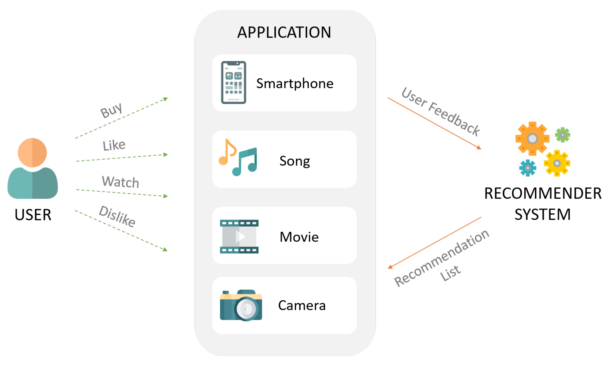

# Product Recommender System
This project focuses on developing a Recommender System that identifies relationships between customers and suggests a list of products that a specific customer may purchase, whether it's their first-time purchase or a repurchase.
**By Anh Tran**

## Project Overview
The Recommender System is primarily built using the Recommender Base from the Implicit package and Streamlit. The project leverages these technologies to provide an intuitive and user-friendly interface for users to interact with the system.

## Getting Started
To use the Recommender System, please follow these steps:

1. Download all the necessary data files and utility functions.
2. Ensure that the required dependencies are installed (Python 3.7+, Implicit package, Streamlit).
3. Run the "Recommend_Products.py" script in your preferred IDE or Terminal to launch the Recommender System interface.
4. Use the interface to input customer information and receive personalized product recommendations.

## File Structure
The project's file structure is organized as follows:
- pages/                     (directory containing Streamlit pages)
  - `01_Similar_Materials.py`                 (Streamlit page 1)
  - `02_New_Customer.py`                 (Streamlit page 2)
  - `03_Target_Customer.py`                 (Streamlit page 3)

Once the Recommender System interface is running, you can navigate through the different pages within the Streamlit interface. Each page represents a specific functionality, such as customer information input, product recommendations, or system settings. Use the interface to input customer information, explore product recommendations, and customize the system according to your preferences.

- `README.md`                  (project README file)

- `data`                      (directory containing data files)
- `utils.py`                   (utility functions used in multiple pages of an application)
- `Recommend_Products.py`      (main script to run the Recommender System)

## Dependencies
The following dependencies are required to run the Recommender System:

- Python 3.7+
- Implicit package
- Streamlit
Make sure to install the necessary packages before running the system.

## Acknowledgements
The Recommender System project was developed by Anh Tran as part of a Data Scientist Internship at Oregon Tool, Inc. It utilizes the Implicit package and Streamlit to provide an efficient and user-friendly recommendation system.

For more information and detailed documentation, please refer to the project's code and comments.
